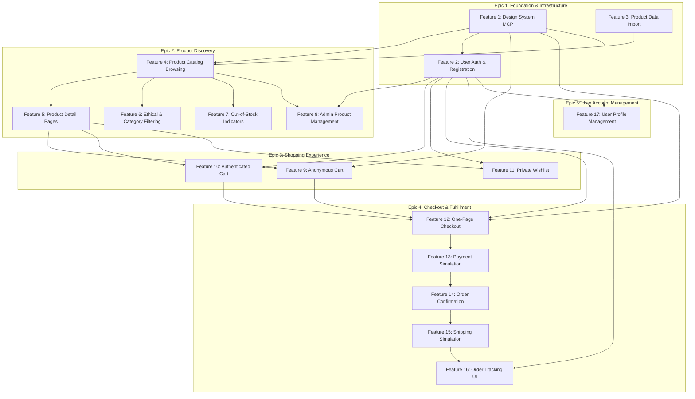

# Feature Execution Flow

**Document Purpose:** Defines the dependency order and parallelism opportunities for all 17 features across 5 epics.

---

## Dependency Diagram

---

## Critical Path

The longest dependency chain that determines minimum project duration:

1. **Design System MCP** (Feature 1) - 1-2 weeks
2. **Product Catalog Browsing** (Feature 4) - 1-2 weeks
3. **Product Detail Pages** (Feature 5) - 1 week
4. **Authenticated Cart** (Feature 10) - 1 week
5. **One-Page Checkout** (Feature 12) - 1 week
6. **Payment Simulation** (Feature 13) - 1 week
7. **Order Confirmation** (Feature 14) - 3-5 days
8. **Shipping Simulation** (Feature 15) - 3-5 days
9. **Order Tracking UI** (Feature 16) - 1 week

**Total Critical Path Duration:** ~8-10 weeks

---

## Parallel Execution Tracks

### Track 1: Foundation (Week 1-2)
**Can execute in parallel:**
- Feature 1: Design System MCP
- Feature 2: User Authentication
- Feature 3: Product Data Import

**Team allocation:** 3 developers

---

### Track 2: Catalog Features (Week 3-5)
**Sequential:**
- Feature 4: Product Catalog Browsing (Week 3)

**After F4 complete, parallel:**
- Feature 5: Product Detail Pages
- Feature 6: Ethical Filtering
- Feature 7: Out-of-Stock Indicators
- Feature 8: Admin Product Management

**Team allocation:** 1 developer for F4, then 4 developers for F5-F8 in parallel

---

### Track 3: Cart & Profile (Week 4-6)
**After F5 complete, parallel:**
- Feature 9: Anonymous Cart
- Feature 10: Authenticated Cart
- Feature 11: Wishlist

**Can execute in parallel (after F2):**
- Feature 17: User Profile Management

**Team allocation:** 3 developers for cart features, 1 for profile

---

### Track 4: Checkout Flow (Week 7-10)
**Sequential (critical path):**
1. Feature 12: One-Page Checkout (Week 7)
2. Feature 13: Payment Simulation (Week 8)
3. Feature 14: Order Confirmation (Week 8)
4. Feature 15: Shipping Simulation (Week 9)
5. Feature 16: Order Tracking UI (Week 10)

**Team allocation:** 2 developers (pair on critical path features)

---

## Dependency Matrix

| Feature | Depends On | Blocks |
|---------|-----------|--------|
| F1: Design System MCP | - | F4, F2, F9, F12, F17 |
| F2: User Auth | F1 | F8, F10, F11, F12, F16, F17 |
| F3: Product Data Import | - | F4 |
| F4: Product Catalog | F1, F3 | F5, F6, F7, F8 |
| F5: Product Detail | F4 | F9, F10, F11 |
| F6: Ethical Filtering | F4 | - |
| F7: Out-of-Stock | F4 | - |
| F8: Admin Product Mgmt | F2, F4 | - |
| F9: Anonymous Cart | F1, F5 | F12 |
| F10: Authenticated Cart | F2, F5 | F12 |
| F11: Wishlist | F2, F5 | - |
| F12: One-Page Checkout | F1, F2, F9, F10 | F13 |
| F13: Payment Simulation | F12 | F14 |
| F14: Order Confirmation | F13 | F15 |
| F15: Shipping Simulation | F14 | F16 |
| F16: Order Tracking UI | F2, F15 | - |
| F17: User Profile | F1, F2 | - |

---

## Execution Recommendations

### Phase 1: Foundation (Weeks 1-2)
**Goal:** Unblock all downstream work

**Priority:**
1. Design System MCP (highest priority - blocks all UI)
2. User Authentication (blocks authenticated features)
3. Product Data Import (blocks catalog features)

**Success Gate:** All 3 foundation features complete before proceeding

---

### Phase 2: Core Discovery (Weeks 3-5)
**Goal:** Enable product browsing and discovery

**Priority:**
1. Product Catalog Browsing (blocks everything else in Epic 2)
2. Product Detail Pages (blocks cart features)
3. Filtering, Stock Indicators, Admin UI (parallel after catalog/detail)

**Success Gate:** Users can browse and view products

---

### Phase 3: Shopping Flow (Weeks 4-7)
**Goal:** Enable cart building (starts during Phase 2)

**Priority:**
1. Anonymous & Authenticated Cart (parallel development)
2. Wishlist
3. User Profile (can execute anytime after auth)

**Success Gate:** Users can build and persist carts

---

### Phase 4: Transaction Flow (Weeks 7-10)
**Goal:** Complete end-to-end purchase and tracking

**Priority:**
1. Checkout → Payment → Order → Shipping → Tracking (sequential)

**Success Gate:** Full e-commerce flow functional

---

## Risk Mitigation

**Risk:** Foundation delays cascade to all features  
**Mitigation:** Prioritize Epic 1 ruthlessly; consider temporary mocks if delays occur

**Risk:** Critical path features serial, no parallelism  
**Mitigation:** Pair programming on checkout flow; comprehensive testing to avoid rework

**Risk:** Integration challenges between epics  
**Mitigation:** Integration tests after each epic; regular cross-team sync

---

## Success Metrics

Track progress via:
- Features completed per week (target: 2-3)
- Critical path vs actual timeline
- Blocker resolution time
- Integration test pass rate

**Target MVP Completion:** 10 weeks with team of 4-6 developers

---

## Appendix: Feature Flag Rollout Order

Post-development, features should be rolled out in this order:

1. Foundation features (no flags needed - dev tools)
2. Catalog browsing + detail pages
3. Filtering, stock indicators, admin UI
4. Anonymous cart
5. Authenticated cart + wishlist
6. User profile
7. Checkout flow (all 5 features together as atomic unit)

**Rationale:** Maintain functional completeness at each rollout stage
