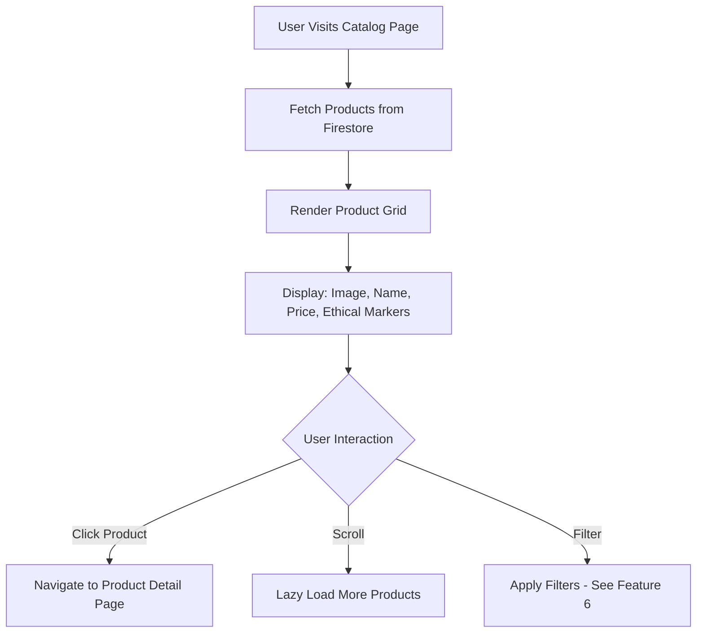

# Feature: Product Catalog Browsing

> **Purpose:**
> This document defines a single feature's intent, scope, user experience, and completion criteria.
> It is the **single source of truth** for planning, review, automation, and execution.

---

## 0. Metadata

All metadata is defined in the frontmatter above (between the `---` markers).

---

## 1. Overview

Display grid view of all products with essential information (name, price, primary image, ethical markers) from Firestore, enabling users to discover and browse the complete catalog.

- **What this feature enables:** Visual exploration of the complete product catalog with key attributes visible at a glance
- **Why it exists:** To provide the primary product discovery experience where users can scan available products quickly
- **What meaningful change it introduces:** Transforms static product data into an interactive, browsable shopping experience

This is the foundation for product discovery and the entry point for most customer journeys.

## Flow Diagram



Caption: "Product catalog browsing flow with lazy loading and navigation."

---

## 2. User Problem

Users visiting itsme.fashion need to explore available clean beauty products, but face challenges:

- **Product Discovery:** Cannot see what products are available without a visual catalog
- **Decision Paralysis:** Too many products displayed at once overwhelms users
- **Slow Loading:** Large product catalogs with images can cause long page load times
- **Key Information Missing:** Need to see price and ethical markers immediately to make informed browsing decisions

Without effective catalog browsing:

- Users cannot discover products efficiently
- High bounce rates from overwhelming or slow experiences
- Missed opportunities to showcase ethical product attributes
- Increased support inquiries asking "what products do you have?"

---

## 3. Goals

### User Experience Goals

- **Fast Initial Load:** First products visible within 2 seconds
- **Clear Visual Hierarchy:** Product name, price, and ethical markers immediately scannable
- **Smooth Scrolling:** Lazy loading prevents performance degradation with large catalogs
- **Immediate Navigation:** Single click to product detail page

### Business / System Goals

- Maximize product exposure and discovery
- Reduce time-to-first-product-view
- Create foundation for filtering and search features
- Establish patterns for image optimization and caching

---

## 4. Non-Goals

- **Product Search:** Keyword search deferred to post-MVP
- **Sorting:** Price sorting, name sorting deferred
- **Pagination Controls:** Uses infinite scroll only (no page numbers)
- **Grid Layout Customization:** Fixed grid responsive layout (no user-configurable views)
- **Product Comparison:** Side-by-side comparison UI deferred
- **Recently Viewed:** Product history tracking deferred

---

## 5. Functional Scope

The catalog browsing feature provides:

- **Product Grid:** Responsive grid layout (4 columns desktop, 2 columns tablet, 1 column mobile)
- **Product Cards:** Each card displays primary product image, name, price (GBP), and ethical marker badges
- **Lazy Loading:** Initial load shows 24 products; scrolling loads 24 more as user reaches bottom
- **Navigation:** Clicking a product card navigates to product detail page
- **Loading States:** Skeleton screens during initial load and lazy loading
- **Empty State:** Message displayed if no products exist in catalog

The system:

- Queries Firestore `products` collection with pagination cursors
- Optimizes images via lazy loading and srcset for responsive sizes
- Caches product data client-side for session duration
- Handles Firestore query errors with user-friendly messages

---

## 6. Dependencies & Assumptions

**Dependencies:**

- Product Data Import (Feature 3) must be complete
- Design System MCP (Feature 1) for component styling
- Firestore with populated `products` collection
- Image hosting for product images (URLs in Firestore documents)

**Assumptions:**

- All products have at least one image URL
- Ethical marker fields (vegan, cruelty-free) are boolean in Firestore
- Prices are stored as numbers in GBP
- Images are hosted externally (CDN or Firebase Storage)
- Product catalog size < 10,000 products for MVP

**Constraints:**

- Must work on Firebase Emulator for development
- Grid layout must be responsive (mobile-first)
- Initial page load must meet P95 ≤ 2s NFR
- Must support browsers from Baseline 2024

---

## 7. User Stories & Experience Scenarios

---

### User Story 1 — Discovering Products

**As a** new visitor exploring itsme.fashion
**I want** to see the available products in an organized grid
**So that** I can quickly scan options and find products that interest me

---

#### Scenarios

##### Scenario 1.1 — First-Time Catalog Visit

**Given** a new user visits the catalog page
**And** the Firestore contains 200 products
**When** the page loads
**Then** a loading skeleton appears immediately
**And** the first 24 products render within 2 seconds
**And** each product card shows image, name, price, and ethical markers
**And** the user can scroll smoothly through the grid

---

##### Scenario 1.2 — Scrolling for More Products

**Given** a user has viewed the initial 24 products
**When** they scroll to the bottom of the grid
**Then** a loading indicator appears
**And** the next 24 products load within 1 second
**And** append smoothly to the existing grid
**And** no duplicate products appear
**And** scroll position is maintained (no jump to top)

---

##### Scenario 1.3 — Returning to Catalog from Detail Page

**Given** a user navigated to a product detail page
**When** they use browser back button or click "Back to Catalog"
**Then** the catalog page restores their previous scroll position
**And** previously loaded products are still cached
**And** no full page reload occurs
**And** the experience feels instant

---

##### Scenario 1.4 — Catalog Load Failure

**Given** Firestore is unreachable or returns an error
**When** the catalog page attempts to load products
**Then** the loading skeleton disappears
**And** a clear message displays: "We're having trouble loading products. Please refresh the page or try again later."
**And** a "Retry" button allows re-attempting the load
**And** no broken image placeholders appear

---

##### Scenario 1.5 — Large Catalog Performance

**Given** the catalog contains 1000 products
**When** a user scrolls through 200 products (multiple lazy loads)
**Then** each lazy load completes within 1 second
**And** memory usage remains stable (no memory leaks)
**And** scroll performance remains smooth (60fps)
**And** the page remains responsive

---

##### Scenario 1.6 — Mobile Catalog Experience

**Given** a user on a mobile device (360px viewport width)
**When** they view the catalog
**Then** products display in a single column
**And** product images scale appropriately without distortion
**And** ethical marker badges remain readable
**And** tap targets meet 44px minimum size
**And** the experience feels native and responsive

---

### User Story 2 — Navigating to Product Details

**As a** user browsing the catalog
**I want** to click a product to see full details
**So that** I can make an informed purchase decision

---

#### Scenarios

##### Scenario 2.1 — Clicking Product Card

**Given** a user is viewing the catalog grid
**When** they click on any product card
**Then** they navigate to that product's detail page
**And** the transition feels instant (< 500ms)
**And** the detail page shows the correct product information

---

## 8. Edge Cases & Constraints (Experience-Relevant)

- **Empty Catalog:** If no products exist, display message: "No products available yet. Check back soon!"
- **Missing Images:** If product image fails to load, show placeholder with product name initials
- **Long Product Names:** Truncate names longer than 50 characters with ellipsis
- **Price Display:** Always show GBP currency symbol (£) and 2 decimal places
- **Ethical Markers:** If product has no ethical markers, no badges appear (don't show "None")

---

## 9. Implementation Tasks (Execution Agent Checklist)

```markdown
- [ ] T01 — Implement product grid layout component with responsive breakpoints
  - [ ] Unit Test: Grid renders 4 columns on desktop (>1024px width)
  - [ ] Unit Test: Grid renders 2 columns on tablet (768-1024px width)
  - [ ] Unit Test: Grid renders 1 column on mobile (<768px width)
  - [ ] E2E Test: Grid layout adapts correctly when viewport resized
- [ ] T02 — Implement Firestore query with pagination for lazy loading
  - [ ] Unit Test: Initial query fetches first 24 products
  - [ ] Unit Test: Subsequent queries use pagination cursor correctly
  - [ ] Integration Test: No duplicate products across paginated requests
  - [ ] Integration Test: Pagination cursor advances correctly
- [ ] T03 — Implement product card component displaying image, name, price, ethical markers
  - [ ] Unit Test: Product card renders all expected fields
  - [ ] Unit Test: Ethical marker badges display correctly for vegan/cruelty-free products
  - [ ] Unit Test: Price formats correctly with GBP symbol and 2 decimals
  - [ ] E2E Test: Product card click navigates to detail page
- [ ] T04 — Implement lazy loading with scroll detection and loading states
  - [ ] Unit Test: Scroll detection triggers next page load at 80% scroll
  - [ ] Integration Test: Skeleton loading state appears during initial load
  - [ ] E2E Test: Lazy loading appends products without scroll jump
- [ ] T05 — [Rollout] Implement feature flag gating for catalog visibility
  - [ ] Integration Test: Catalog hidden when flag disabled
  - [ ] Integration Test: Catalog loads correctly when flag enabled
```

---

## 10. Acceptance Criteria (Verifiable Outcomes)

```markdown
- [ ] AC1 — Product grid displays first 24 products within 2 seconds
  - [ ] E2E test passed: Page load time P95 ≤ 2s
  - [ ] E2E test passed: 24 product cards visible on initial render
- [ ] AC2 — Lazy loading works smoothly with no duplicates
  - [ ] Integration test passed: Pagination cursor prevents duplicates
  - [ ] E2E test passed: Scrolling loads additional products without scroll jump
- [ ] AC3 — Product cards display all required information correctly
  - [ ] Unit test passed: Image, name, price, ethical markers all rendered
  - [ ] E2E test passed: Product card click navigates to correct detail page
- [ ] AC4 — Grid layout is responsive across device sizes
  - [ ] E2E test passed: 4 columns on desktop, 2 on tablet, 1 on mobile
  - [ ] E2E test passed: Mobile tap targets meet 44px minimum
- [ ] AC5 — [Gating] Feature flag controls catalog visibility
  - [ ] Integration test passed: Catalog component gated by feature flag
```

---

## 11. Rollout & Risk

### Rollout Strategy

**Temporary feature flag** — Controls catalog browsing visibility during phased rollout.

### Remote Config Flags

<!-- REMOTE_CONFIG_FLAG_START -->
| Context | Type | Namespace | Default (Dev) | Default (Stg) | Default (Prod) | Key |
|---------|------|-----------|---------------|---------------|----------------|-----|
| product_catalog_browsing | BOOLEAN | client | true | false | false | _auto-generated_ |
<!-- REMOTE_CONFIG_FLAG_END -->

**Purpose:** Allow internal testing of catalog performance before public exposure.

**Removal Criteria:**

- Flag enabled at 100% for 2 weeks
- Page load time consistently meets NFR-001 (P95 ≤ 2s)
- No critical performance or data loading issues

---

## 12. History & Status

- **Status:** Draft
- **Related Epics:** Product Discovery
- **Related Issues:** `<created post-merge>`

---

## Final Note

> This document defines **intent and experience**.
> Execution details are derived from it — never the other way around.
