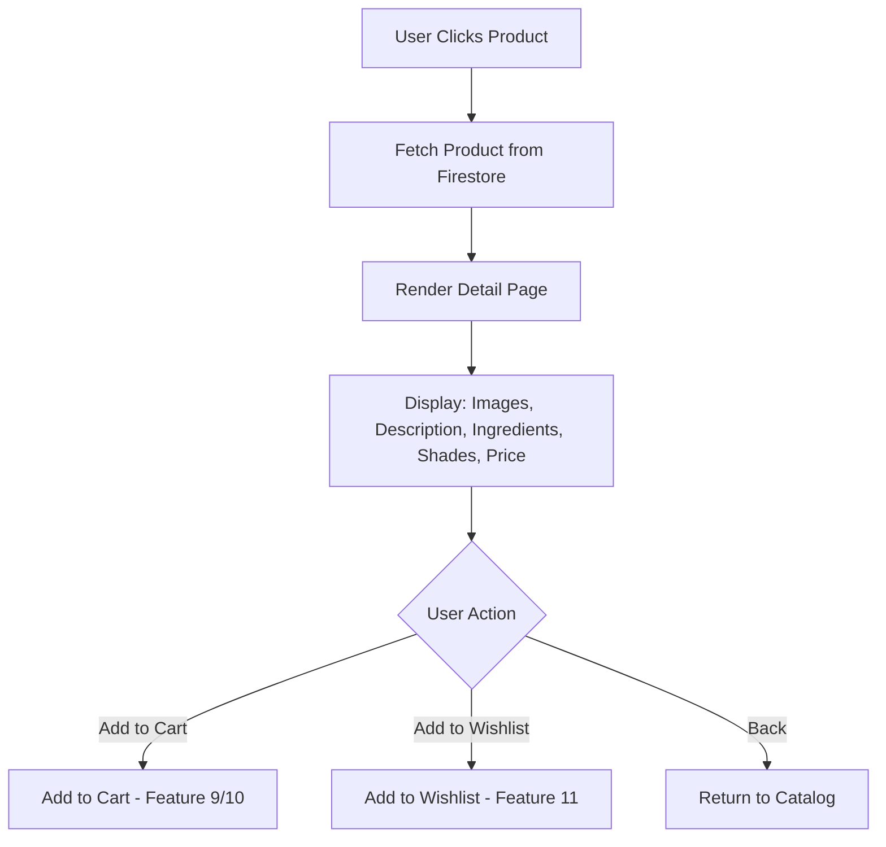

# Feature: Product Detail Pages

> **Purpose:**
> This document defines a single feature's intent, scope, user experience, and completion criteria.
> It is the **single source of truth** for planning, review, automation, and execution.

---

## 0. Metadata

All metadata is defined in the frontmatter above (between the `---` markers).

---

## 1. Overview

Detailed product view showing ingredients, usage instructions, shade colors (as hex-based swatches), and full product attributes enables informed purchase decisions.

- **What this feature enables:** Comprehensive product information access for users to evaluate products before adding to cart
- **Why it exists:** To build trust through transparency and provide all information needed for confident purchasing
- **What meaningful change it introduces:** Transforms quick browsing into deep product evaluation with full attribute visibility

## Flow Diagram



Caption: "Product detail page flow with cart and wishlist actions."

---

## 2. User Problem

Users need comprehensive product information to make informed purchase decisions, but currently face:

- **Information Deficit:** Cannot see full ingredients, usage instructions, or detailed specifications
- **Shade Representation:** Unable to visualize product shades/colors without physical swatches
- **Trust Barriers:** Uncertainty about product authenticity and ethical claims
- **Decision Paralysis:** Insufficient information leads to abandoned browsing or cart abandonment

---

## 3. Goals

### User Experience Goals

- **Complete Transparency:** All product information visible without hunting or clicking through tabs
- **Visual Shade Representation:** Hex-based color swatches provide accurate shade preview
- **Quick Actions:** Add to cart and wishlist accessible without leaving page
- **Fast Loading:** Page interactive within 1.5 seconds

### Business / System Goals

- Reduce cart abandonment through detailed product information
- Build customer trust via ingredient transparency
- Create foundation for future features (reviews, Q&A)
- Track product detail page engagement (KPI-003: ≥90 sec average time)

---

## 4. Non-Goals

- **Product Reviews:** User-generated reviews deferred to post-MVP
- **Product Q&A:** Community questions deferred
- **Shade Selection:** Actual SKU selection happens at checkout (shades display-only)
- **Stock Levels:** Real-time inventory deferred (out-of-stock indicators only)
- **Product Recommendations:** "You may also like" deferred
- **Zoom/Gallery:** Image zoom and multi-image gallery deferred

---

## 5. Functional Scope

The product detail page provides:

- **Product Images:** Primary product image with alt text
- **Product Information:** Name, brand, category, price (GBP), description
- **Ethical Markers:** Vegan, cruelty-free badges prominently displayed
- **Ingredients List:** Full ingredient list with clear formatting
- **Usage Instructions:** How to use the product
- **Shade Swatches:** Hex-based color swatches for products with shades
- **Action Buttons:** Add to cart, add to wishlist (auth required)
- **Stock Status:** Out-of-stock indicator if applicable

---

## 6. Dependencies & Assumptions

**Dependencies:**

- Product Catalog Browsing (Feature 4) for navigation source
- Design System MCP (Feature 1) for component styling
- Firestore with product data including ingredients, usage, shades

**Assumptions:**

- Product IDs are unique and URL-safe
- All products have at least description and price
- Shades stored as array of hex codes (e.g., ["#FF5733", "#C70039"])
- Ingredients stored as comma-separated string or array

---

## 7. User Stories & Experience Scenarios

---

### User Story 1 — Evaluating Product Details

**As a** conscious consumer researching clean beauty products
**I want** to see complete product information including ingredients and ethical markers
**So that** I can make informed decisions aligned with my values

---

#### Scenarios

##### Scenario 1.1 — First-Time Product View

**Given** a user clicks a product from the catalog
**When** the detail page loads
**Then** all product information appears within 1.5 seconds
**And** ingredients list is clearly formatted
**And** ethical marker badges are prominently displayed
**And** shade swatches render with accurate hex colors

##### Scenario 1.2 — Returning to Previously Viewed Product

**Given** a user viewed a product earlier in their session
**When** they navigate back to the same product
**Then** the page loads instantly from cache
**And** all product data is identical to first view

##### Scenario 1.3 — Product Not Found

**Given** a user navigates to a non-existent product ID
**When** the page attempts to load
**Then** a 404 message displays: "Product not found"
**And** a link to return to catalog is provided

##### Scenario 1.4 — Slow Network

**Given** a user on a slow 3G connection
**When** the product detail page loads
**Then** a skeleton loading state appears immediately
**And** critical information (name, price) loads first
**And** images load progressively
**And** the page remains interactive during loading

---

### User Story 2 — Adding Product to Cart

**As a** user evaluating a product
**I want** to add it to my cart directly from the detail page
**So that** I can continue shopping without losing my selection

---

#### Scenarios

##### Scenario 2.1 — Add to Cart Success

**Given** a user is viewing a product detail page
**And** the product is in stock
**When** they click "Add to Cart"
**Then** the product is added to their cart
**And** a confirmation notification appears
**And** the cart icon updates with item count
**And** the user remains on the detail page

---

## 8. Edge Cases & Constraints

- **Missing Ingredients:** Display "Ingredients not available" if field empty
- **No Shades:** Don't show shade section if product has no shades
- **Long Descriptions:** Descriptions > 500 characters show "Read more" expansion
- **Large Image Files:** Images must be optimized (< 200KB per image)

---

## 9. Implementation Tasks

```markdown
- [ ] T01 — Implement product detail page component with all information sections
  - [ ] Unit Test: All product fields render correctly
  - [ ] E2E Test: Product detail loads from catalog navigation
- [ ] T02 — Implement shade swatch rendering from hex codes
  - [ ] Unit Test: Hex codes convert to visual swatches
  - [ ] E2E Test: Swatches display correct colors
- [ ] T03 — Implement add to cart action integration
  - [ ] Integration Test: Add to cart updates cart state
  - [ ] E2E Test: Cart icon updates after add
- [ ] T04 — Implement loading states and error handling
  - [ ] Unit Test: 404 handling for invalid product IDs
  - [ ] E2E Test: Loading skeleton appears during fetch
- [ ] T05 — [Rollout] Implement feature flag gating
  - [ ] Integration Test: Detail page gated by flag
```

---

## 10. Acceptance Criteria

```markdown
- [ ] AC1 — Product detail page loads within 1.5 seconds
  - [ ] E2E test passed: Page interactive in ≤1.5s
- [ ] AC2 — All product information displays correctly
  - [ ] Unit test passed: Ingredients, usage, shades render
  - [ ] E2E test passed: Ethical markers visible
- [ ] AC3 — Add to cart works from detail page
  - [ ] E2E test passed: Product added to cart successfully
- [ ] AC4 — Shade swatches display accurate colors
  - [ ] Unit test passed: Hex codes rendered as swatches
- [ ] AC5 — [Gating] Feature flag controls detail page
  - [ ] Integration test passed: Detail page gated correctly
```

---

## 11. Rollout & Risk

### Remote Config Flags

<!-- REMOTE_CONFIG_FLAG_START -->
| Context | Type | Namespace | Default (Dev) | Default (Stg) | Default (Prod) | Key |
|---------|------|-----------|---------------|---------------|----------------|-----|
| product_detail_pages | BOOLEAN | client | true | false | false | _auto-generated_ |
<!-- REMOTE_CONFIG_FLAG_END -->

---

## 12. History & Status

- **Status:** Draft
- **Related Epics:** Product Discovery
- **Related Issues:** `<created post-merge>`

---

## Final Note

> This document defines **intent and experience**.
> Execution details are derived from it — never the other way around.
