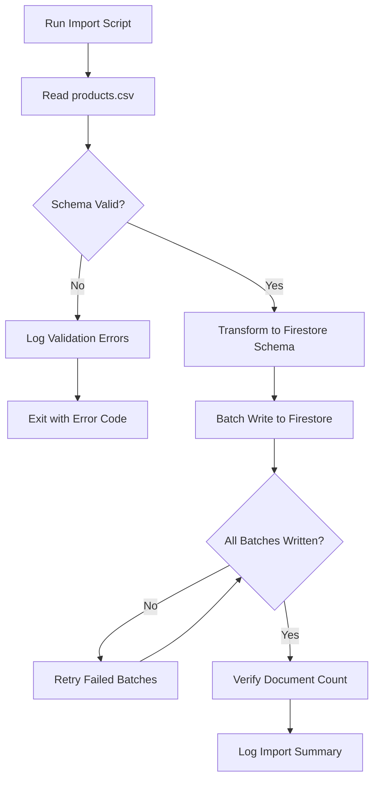

# Feature: Product Data Import

> **Purpose:**
> This document defines a single feature's intent, scope, user experience, and completion criteria.
> It is the **single source of truth** for planning, review, automation, and execution.

---

## 0. Metadata

All metadata is defined in the frontmatter above (between the `---` markers).

**Important:** The frontmatter is used by automation scripts to:

- Create GitHub issues
- Link features to parent epics
- Generate feature flags
- Track status and ownership

---

## 1. Overview

Initial CSV data import script seeds Firestore with the product catalog from `data/products.csv`, including ethical markers and shade hex codes, establishing the foundation for all catalog-based features.

- **What this feature enables:** Automated, validated import of product data from CSV into Firestore
- **Why it exists:** To bootstrap the product catalog from the definitive client-provided dataset
- **What meaningful change it introduces:** Transforms static CSV data into queryable, structured Firestore documents accessible by all catalog features

This is a one-time bootstrap prerequisite for product browsing, filtering, and cart features.

## Flow Diagram



Caption: "Product data import flow with validation and error handling."

---

## 2. User Problem

Platform operators and developers need to populate Firestore with product data, but face challenges:

- **Manual Data Entry:** Entering hundreds of products manually is error-prone and time-intensive
- **Schema Mismatches:** CSV columns may not align with Firestore document structure
- **Data Quality Issues:** Missing required fields, invalid ethical markers, or malformed shade hex codes cause runtime errors
- **Import Failures:** Partial imports leave catalog in inconsistent state
- **No Verification:** Difficult to confirm all products imported correctly

Without automated import:

- Development blocked waiting for manual data entry
- High risk of data inconsistencies and missing products
- No reproducible way to reset catalog to known-good state
- Impossible to test catalog features with realistic data volume

---

## 3. Goals

### User Experience Goals

- **For Developers:** Run a single command to populate Firestore with complete, valid product catalog
- **For Platform Operators:** Confidence that CSV data is accurately represented in Firestore
- **For End Users:** Access to complete, accurate product catalog without missing items or incorrect attributes

### Business / System Goals

- Enable rapid development and testing with realistic product data
- Establish products.csv as single source of truth for initial catalog
- Validate data quality before Firestore insertion to prevent runtime errors
- Create reproducible import process for emulator resets and testing

---

## 4. Non-Goals

- **Ongoing Sync:** CSV is bootstrap only; post-launch updates via Admin UI (not CSV re-import)
- **Incremental Updates:** Each import is full-replace (no diff-based updates)
- **Image Upload:** CSV contains image URLs only; actual image hosting handled separately
- **Inventory Management:** Stock levels managed via Admin UI post-import
- **Multi-Tenancy:** Import targets single Firestore database only
- **CSV Validation UI:** Command-line tool only; no web-based validation interface

---

## 5. Functional Scope

The import script provides:

- **CSV Parsing:** Reads `data/products.csv` with header row detection and field mapping
- **Schema Validation:** Ensures all required fields present (id, name, price, category, ethical markers)
- **Data Transformation:** Converts CSV rows to Firestore document structure (flattening, type casting, nested objects)
- **Ethical Marker Processing:** Parses boolean ethical marker columns (Vegan, Cruelty-free) into structured fields
- **Shade Parsing:** Converts shade hex codes from CSV into array of shade objects
- **Batch Writing:** Groups Firestore writes into batches (max 500 documents per batch) for efficiency
- **Error Recovery:** Logs validation errors with row numbers for CSV correction
- **Import Verification:** Confirms total document count matches CSV row count (minus header)

The system:

- Runs as a Node.js script executable via `npm run import-products`
- Targets Firebase Emulator Firestore during development
- Produces detailed logs showing import progress and any failures
- Exits with non-zero code on critical errors (validation failures, write errors)
- Can be re-run idempotently (replaces existing products collection)

---

## 6. Dependencies & Assumptions

**Dependencies:**

- Node.js runtime (v18+)
- Firebase Admin SDK for Firestore writes
- CSV parsing library (e.g., `csv-parse`)
- Firebase Emulator Suite running locally

**Assumptions:**

- `data/products.csv` is well-formed with consistent column structure
- CSV header row matches expected field names (exact match or documented mapping)
- Ethical marker columns contain `true`/`false` or `1`/`0` values
- Shade hex codes are comma-separated valid hex values (e.g., `#FF5733,#C70039`)
- All product IDs are unique within the CSV

**Constraints:**

- Must use Firebase Emulator for development (no live Firestore writes)
- Import script must be runnable from repository root via npm script
- CSV file location fixed at `data/products.csv`
- Firestore collection name fixed at `products`
- Maximum batch size 500 documents per Firestore limit

---

## 7. User Stories & Experience Scenarios

---

### User Story 1 — Initial Catalog Bootstrap

**As a** platform developer setting up the local environment
**I want** to run a single command to import all product data
**So that** I can immediately start developing and testing catalog features with realistic data

---

#### Scenarios

##### Scenario 1.1 — Successful First-Time Import

**Given** a fresh Firestore emulator with no existing products
**And** `data/products.csv` contains 200 valid product rows
**When** the developer runs `npm run import-products`
**Then** the script reads all CSV rows
**And** validates schema for all rows
**And** writes 200 documents to Firestore in batches
**And** logs a success message: "Import complete: 200 products imported"
**And** the script exits with code 0

---

##### Scenario 1.2 — Re-Import to Reset Catalog

**Given** Firestore already contains 200 products from previous import
**And** the developer wants to reset catalog to known state
**When** they run `npm run import-products` again
**Then** existing products collection is replaced
**And** new documents match CSV exactly
**And** document count remains 200
**And** no duplicate products exist

---

##### Scenario 1.3 — Import Interrupted Midway

**Given** an import is running with 100 of 200 products written
**When** the process is killed (Ctrl+C or system crash)
**And** the developer re-runs `npm run import-products`
**Then** the script detects partial state
**And** clears incomplete import
**And** starts fresh import from beginning
**And** completes successfully with all 200 products

---

##### Scenario 1.4 — CSV Validation Failure

**Given** `data/products.csv` contains a row with missing `name` field (required)
**When** the import script runs
**Then** validation fails for that row
**And** the script logs an error: "Row 45: Missing required field 'name'"
**And** the script does NOT write any documents to Firestore
**And** the script exits with code 1
**And** the developer can correct the CSV and retry

---

##### Scenario 1.5 — Large CSV Performance

**Given** `data/products.csv` contains 1000 product rows
**When** the import script runs
**Then** all products are imported in under 30 seconds
**And** memory usage remains below 500MB
**And** batching prevents Firestore rate limit errors
**And** progress logs update every 100 products to show liveness

---

##### Scenario 1.6 — Firestore Emulator Offline

**Given** the Firebase Emulator is not running
**When** the developer runs `npm run import-products`
**Then** the script immediately detects emulator is unreachable
**And** displays a clear error: "Firestore emulator not running. Start with `firebase emulators:start`"
**And** exits with code 1
**And** no data corruption occurs

---

### User Story 2 — Data Quality Validation

**As a** platform operator ensuring catalog integrity
**I want** validation errors to clearly identify CSV issues
**So that** I can correct data before import without trial-and-error

---

#### Scenarios

##### Scenario 2.1 — Invalid Ethical Marker Values

**Given** a CSV row has `Vegan` field set to `"maybe"` (invalid boolean)
**When** validation runs
**Then** the script logs: "Row 23: Invalid value for 'Vegan' (expected true/false, got 'maybe')"
**And** suggests valid values in error message
**And** import halts before Firestore writes

---

##### Scenario 2.2 — Malformed Shade Hex Codes

**Given** a CSV row has shade value `"#GGGGGG"` (invalid hex)
**When** validation runs
**Then** the script logs: "Row 67: Invalid hex code '#GGGGGG' in shades field"
**And** import halts before Firestore writes

---

## 8. Edge Cases & Constraints (Experience-Relevant)

- **Empty CSV:** If CSV has header but no data rows, import logs warning and exits gracefully
- **Duplicate Product IDs:** If CSV contains duplicate IDs, last occurrence wins (logs warning about duplicates)
- **Special Characters:** Product names with special characters (é, ñ, etc.) must be preserved correctly in Firestore
- **Large Text Fields:** Ingredient lists or descriptions exceeding 10KB must be imported without truncation
- **Boolean Parsing:** Accepts `true`/`false`, `1`/`0`, `yes`/`no` for ethical markers (case-insensitive)

---

## 9. Implementation Tasks (Execution Agent Checklist)

```markdown
- [ ] T01 — Implement CSV parsing with header detection and field mapping
  - [ ] Unit Test: CSV with 10 rows parses correctly into array of objects
  - [ ] Unit Test: Header fields mapped to expected Firestore schema fields
- [ ] T02 — Implement schema validation for required fields and data types
  - [ ] Unit Test: Missing required field detected and logged
  - [ ] Unit Test: Invalid ethical marker value rejected
  - [ ] Unit Test: Malformed hex code in shades detected
- [ ] T03 — Implement Firestore batch writing with error handling
  - [ ] Unit Test: 600 products split into 2 batches (500 + 100)
  - [ ] Integration Test: Batch write commits successfully to emulator
  - [ ] Integration Test: Failed batch retried once before full failure
- [ ] T04 — Implement import verification and summary logging
  - [ ] Integration Test: Document count in Firestore matches CSV row count
  - [ ] E2E Test: Import logs show success message with correct product count
- [ ] T05 — [Tooling] Package as npm script with clear documentation
  - [ ] E2E Test: `npm run import-products` executes successfully from repo root
  - [ ] Integration Test: Script exits with code 0 on success, code 1 on failure
```

---

## 10. Acceptance Criteria (Verifiable Outcomes)

```markdown
- [ ] AC1 — CSV data successfully imported to Firestore emulator
  - [ ] Integration test passed: All products from CSV exist as Firestore documents
  - [ ] E2E test passed: `npm run import-products` completes without errors
- [ ] AC2 — Schema validation prevents invalid data from reaching Firestore
  - [ ] Unit test passed: Missing required fields detected
  - [ ] Unit test passed: Invalid ethical markers rejected
  - [ ] E2E test passed: Import halts with clear error on validation failure
- [ ] AC3 — Ethical markers and shades correctly parsed and structured
  - [ ] Unit test passed: Boolean ethical markers stored as true/false
  - [ ] Unit test passed: Shade hex codes stored as array of objects
  - [ ] Integration test passed: Firestore documents have correct nested structure
- [ ] AC4 — Import is idempotent and can be re-run safely
  - [ ] Integration test passed: Re-running import replaces existing products without duplicates
  - [ ] E2E test passed: Final document count matches CSV row count after multiple runs
- [ ] AC5 — Import script provides clear feedback and error messages
  - [ ] E2E test passed: Progress logs appear during import
  - [ ] E2E test passed: Validation errors include row numbers and field names
```

---

## 11. Rollout & Risk

### Rollout Strategy

**No feature flag required** — This is a development/operations tool, not a user-facing feature. Rollout controlled by:

1. Script availability in repository npm scripts
2. Documentation in repository README
3. Integration into developer onboarding checklist

### Risk Mitigation

- **Risk:** CSV corruption leads to invalid Firestore data
  - **Mitigation:** Comprehensive validation before any writes; import halts on first error
- **Risk:** Partial import leaves catalog incomplete
  - **Mitigation:** Re-import clears previous state; idempotent script design
- **Risk:** Import script points to production Firestore
  - **Mitigation:** Hardcoded emulator connection check; fails if emulator not detected

### Cleanup Criteria

- Script remains permanent development tool
- Post-MVP: Admin UI replaces CSV for ongoing product management
- CSV import script retained for testing and emulator resets

---

## 12. History & Status

- **Status:** Draft
- **Related Epics:** Foundation & Infrastructure
- **Related Issues:** `<created post-merge>`

---

## Final Note

> This document defines **intent and experience**.
> Execution details are derived from it — never the other way around.