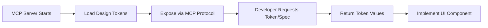

# Feature: Design System MCP

> **Purpose:**
> This document defines a single feature's intent, scope, user experience, and completion criteria.
> It is the **single source of truth** for planning, review, automation, and execution.

---

## 0. Metadata

All metadata is defined in the frontmatter above (between the `---` markers).

**Important:** The frontmatter is used by automation scripts to:

- Create GitHub issues
- Link features to parent epics
- Generate feature flags
- Track status and ownership

---

## 1. Overview

The Design System MCP (Model Context Protocol) server delivers design tokens and Lit web component specifications to ensure consistent UI implementation across the itsme.fashion e-commerce platform.

- **What this feature enables:** Centralized design token access (colors, spacing, typography) and component specifications via MCP for all frontend development
- **Why it exists:** To ensure visual consistency, reduce design drift, and enable rapid, standardized UI component creation
- **What meaningful change it introduces:** Transforms ad-hoc UI development into a systematic, token-driven approach where all visual decisions reference a single source of truth

This is a prerequisite for all UI implementation work across the platform.

## Flow Diagram



Caption: "High-level flow for design token delivery via MCP."

---

## 2. User Problem

Frontend developers and UI implementers currently lack a centralized, programmatic source for design tokens and component specifications, leading to:

- **Inconsistent visual implementation:** Colors, spacing, and typography values hardcoded inconsistently across components
- **Design drift over time:** No single source of truth means values diverge as features are added
- **Slow component development:** Developers must manually reference design files or guess at correct values
- **Difficult updates:** Changing a design token requires finding and updating all hardcoded instances
- **Poor collaboration:** Design and engineering work from separate sources, increasing miscommunication

This friction creates technical debt, slows development velocity, and degrades the user experience through inconsistent visual presentation.

---

## 3. Goals

### User Experience Goals

- **For Developers:** Instant, programmatic access to correct design values eliminates guesswork and lookup time
- **For Designers:** Confidence that implemented UI matches design specifications without manual verification
- **For End Users:** Consistent, polished visual experience across all platform touchpoints

### Business / System Goals

- Establish design system as prerequisite for all UI features
- Enable rapid UI iteration by decoupling design decisions from implementation
- Reduce code review cycles by eliminating design token disagreements
- Create foundation for future design system evolution (theming, accessibility variants)

---

## 4. Non-Goals

- **UI Component Implementation:** This feature delivers specifications; actual Lit components are implemented by consuming features
- **Design Tool Integration:** No Figma/Sketch plugins or direct design tool export
- **Runtime Theming:** Dynamic theme switching (light/dark mode) is deferred; MCP delivers static tokens only
- **Component Library Hosting:** No npm package or CDN hosting; MCP is the delivery mechanism
- **Visual Testing:** Screenshot comparison or visual regression testing is out of scope

---

## 5. Functional Scope

The Design System MCP provides:

- **Design Tokens:** Structured data for colors (hex codes), spacing (rem/px values), typography (font families, sizes, weights, line heights)
- **Component Specifications:** Structural guidance for Lit web components (expected properties, events, slots)
- **MCP Protocol Compliance:** Standard MCP server implementation enabling programmatic token requests
- **Version Management:** Tokens versioned alongside the server to enable controlled updates

The system:

- Runs as a local MCP server during development
- Responds to token/specification requests with structured JSON
- Validates requests and returns appropriate error messages for unknown tokens
- Maintains backward compatibility for stable token names

---

## 6. Dependencies & Assumptions

**Dependencies:**

- MCP protocol specification and supporting libraries
- Node.js runtime for MCP server implementation
- Lit framework documentation for component specification format

**Assumptions:**

- Developers have MCP client tooling configured in their development environment
- Design tokens are finalized before MCP server implementation begins
- Token naming follows a hierarchical convention (e.g., `color.primary.500`, `spacing.large`)
- All UI features will be blocked until this MCP is available

**Constraints:**

- MCP server must be runnable in local development (no external dependencies)
- Token updates require MCP server version bump
- Initial token set must support MVP feature requirements (catalog, cart, checkout UI)

---

## 7. User Stories & Experience Scenarios

---

### User Story 1 — Token Retrieval for Component Implementation

**As a** frontend developer implementing a UI component
**I want** to request design tokens programmatically via MCP
**So that** I use correct, consistent values without manual lookup or hardcoding

---

#### Scenarios

##### Scenario 1.1 — First-Time Token Request

**Given** a developer is implementing their first component using the design system
**And** the MCP server is running locally
**When** the developer requests a color token (e.g., `color.primary.500`)
**Then** the MCP server returns the hex value immediately
**And** the response includes token metadata (name, value, category)
**And** the developer can copy the value directly into their component

---

##### Scenario 1.2 — Repeated Token Access During Development

**Given** a developer is actively building multiple components
**And** they have successfully retrieved tokens before
**When** they request tokens for spacing, typography, and colors in sequence
**Then** all requests complete within 100ms
**And** responses are cached locally for the development session
**And** the workflow feels instant and non-intrusive

---

##### Scenario 1.3 — Server Restart After Token Update

**Given** a developer is working with an older version of the MCP server
**When** design tokens are updated and the server is restarted
**Then** the new token values are immediately available
**And** previously cached values are invalidated
**And** the developer receives a notification that tokens have been updated

---

##### Scenario 1.4 — Invalid Token Request

**Given** a developer requests a non-existent token (e.g., typo or deprecated name)
**When** the MCP server processes the request
**Then** the server returns a clear error message explaining the token doesn't exist
**And** suggests similar valid token names if available
**And** the developer can correct their request without consulting external documentation

---

##### Scenario 1.5 — High-Volume Token Requests

**Given** an automated build process requests all available tokens for documentation generation
**When** 100+ token requests are made in rapid succession
**Then** the MCP server processes all requests without degradation
**And** the total time remains under 1 second
**And** memory usage stays within acceptable limits

---

##### Scenario 1.6 — Cross-Platform Token Consistency

**Given** developers working on macOS, Linux, and Windows environments
**When** they request the same design token
**Then** all environments return identical values
**And** no platform-specific formatting differences exist
**And** token values render consistently in their respective browsers

---

### User Story 2 — Component Specification Access

**As a** frontend developer creating a new Lit component
**I want** to retrieve component specifications from the MCP
**So that** I follow the correct structural patterns for properties, events, and slots

---

#### Scenarios

##### Scenario 2.1 — Retrieving Component Specification

**Given** a developer needs to implement a button component
**When** they request the button component specification from the MCP
**Then** the server returns a structured specification including required properties, optional properties, events, and slots
**And** the specification includes JSDoc-style documentation
**And** the developer can scaffold their component from the specification

---

##### Scenario 2.2 — Specification Versioning

**Given** a component specification has been updated
**When** a developer requests the specification
**Then** the latest version is returned by default
**And** the developer can optionally request a specific previous version
**And** version changes are documented in the response metadata

---

## 8. Edge Cases & Constraints (Experience-Relevant)

- **Token Naming Collisions:** If two token names are similar (e.g., `primary` vs `primary-dark`), autocomplete suggestions must clearly differentiate them
- **Large Token Sets:** If token count exceeds 500, response pagination may be required to maintain performance
- **Concurrent Access:** Multiple developers on the same team must be able to query the MCP simultaneously without conflicts
- **Offline Development:** While MCP requires local server, developers expect clear messaging if server is unreachable
- **Token Deprecation:** When tokens are deprecated, old names should return warnings (not errors) with migration guidance for 2 version cycles

---

## 9. Implementation Tasks (Execution Agent Checklist)

```markdown
- [ ] T01 — Implement MCP server initialization and token loading from structured JSON source
  - [ ] Unit Test: Token JSON parsing and validation for required schema fields
  - [ ] Unit Test: Server starts successfully and binds to configured port
- [ ] T02 — Implement token request handler with hierarchical lookup (e.g., `color.primary.500`)
  - [ ] Unit Test: Token resolution for valid paths returns correct values
  - [ ] Unit Test: Invalid token paths return appropriate error messages with suggestions
- [ ] T03 — Implement component specification request handler
  - [ ] Unit Test: Component spec returned with all required fields (properties, events, slots)
  - [ ] Integration Test: Specification format is valid for Lit component scaffolding
- [ ] T04 — Implement request caching and cache invalidation on server restart
  - [ ] Unit Test: Repeated requests return cached values within same session
  - [ ] Integration Test: Cache clears correctly on server restart
- [ ] T05 — [Rollout] Package MCP server for local development with documentation
  - [ ] E2E Test: Developer can start server, request tokens, and implement component using returned values
  - [ ] Integration Test: Server runs successfully on macOS, Linux, and Windows
```

---

## 10. Acceptance Criteria (Verifiable Outcomes)

```markdown
- [ ] AC1 — MCP server starts successfully and accepts token requests
  - [ ] Unit test passed: Server initialization completes without errors
  - [ ] E2E test passed: Developer can query server via MCP client tool
- [ ] AC2 — All design tokens (colors, spacing, typography) are accessible via hierarchical paths
  - [ ] Unit test passed: Token resolution returns correct values for all defined tokens
  - [ ] E2E test passed: Component implementation uses tokens and renders correctly
- [ ] AC3 — Component specifications are returned with complete structural metadata
  - [ ] Unit test passed: Specification includes properties, events, and slots
  - [ ] Integration test passed: Generated component scaffolding compiles successfully
- [ ] AC4 — Invalid token requests return helpful error messages
  - [ ] Unit test passed: Error messages include token name suggestions
  - [ ] E2E test passed: Developer can self-correct typos without external help
- [ ] AC5 — MCP server performs efficiently under high request volume
  - [ ] Integration test passed: 100+ token requests complete in under 1 second
  - [ ] Integration test passed: Memory usage remains stable during load
```

---

## 11. Rollout & Risk

### Rollout Strategy

**No feature flag required** — This is a development-time dependency, not a runtime feature. Rollout is controlled by:

1. MCP server package availability in repository
2. Developer documentation update announcing availability
3. Blocking UI feature work until MCP is integrated into development workflow

### Risk Mitigation

- **Risk:** Token changes break existing components
  - **Mitigation:** Semantic versioning for MCP server; deprecation warnings for 2 version cycles
- **Risk:** MCP server unavailable during critical development
  - **Mitigation:** Fallback documentation with static token values; server health check in development setup
- **Risk:** Token naming confusion
  - **Mitigation:** Token naming conventions documented; autocomplete suggestions in MCP client

### Cleanup Criteria

- MCP server remains permanent infrastructure
- No temporary behavior to remove

---

## 12. History & Status

- **Status:** Draft
- **Related Epics:** Foundation & Infrastructure
- **Related Issues:** `<created post-merge>`

---

## Final Note

> This document defines **intent and experience**.
> Execution details are derived from it — never the other way around.
