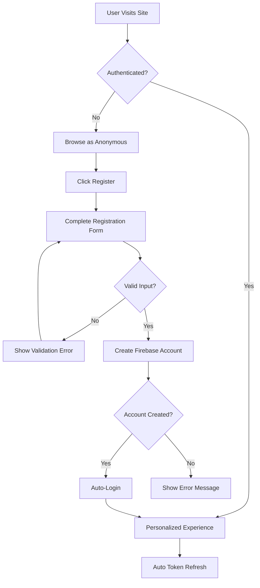

# Feature: User Authentication & Registration

> **Purpose:**
> This document defines a single feature's intent, scope, user experience, and completion criteria.
> It is the **single source of truth** for planning, review, automation, and execution.

---

## 0. Metadata

All metadata is defined in the frontmatter above (between the `---` markers).

**Important:** The frontmatter is used by automation scripts to:

- Create GitHub issues
- Link features to parent epics
- Generate feature flags
- Track status and ownership

---

## 1. Overview

Email and password-based user registration, login, and session management via Firebase Authentication enable users to create accounts and access authenticated features across the itsme.fashion platform.

- **What this feature enables:** Secure account creation, login, session persistence, and automatic token refresh
- **Why it exists:** To enable personalized features (cart persistence, wishlists, order history) and build customer relationships
- **What meaningful change it introduces:** Transforms anonymous browsing into a persistent, personalized shopping experience

This is a prerequisite for all authenticated user flows (cart sync, checkout, order tracking, profile management).

## Flow Diagram



Caption: "User registration and authentication flow with automatic session management."

---

## 2. User Problem

Users seeking personalized shopping experiences face friction when:

- **Session loss:** Anonymous cart state disappears when browser session ends or device changes
- **Repetitive data entry:** Shipping address and preferences must be re-entered for each purchase
- **No order history:** Cannot track past purchases or reorder items
- **Trust barriers:** Hesitant to provide payment information without account security

Without authentication:

- Cart abandonment increases due to data loss
- Checkout friction from manual address entry
- No customer loyalty or relationship building
- Limited personalization opportunities

---

## 3. Goals

### User Experience Goals

- **Frictionless Registration:** Account creation completes in under 30 seconds with minimal required fields
- **Persistent Sessions:** Once authenticated, users remain logged in across sessions without re-login prompts
- **Clear Security:** Users understand password requirements and account protection measures
- **Seamless Transition:** Anonymous cart and browsing state preserved when registering or logging in

### Business / System Goals

- Enable customer relationship management through persistent user identities
- Reduce cart abandonment via cross-device cart synchronization
- Build foundation for order history, wishlists, and personalized recommendations
- Comply with authentication security best practices (password hashing, secure tokens)

---

## 4. Non-Goals

- **Social Login:** OAuth providers (Google, Facebook, Apple) deferred to post-MVP
- **Multi-Factor Authentication (MFA):** SMS or authenticator app verification not required for MVP
- **Password Reset via Email:** Full email workflow deferred; emulator supports basic reset
- **Account Deletion:** GDPR-compliant account deletion deferred
- **Role-Based Access Control:** Admin roles and permissions deferred (simple boolean admin flag only)
- **Session Timeout:** Firebase handles automatic token refresh; no manual timeout enforcement

---

## 5. Functional Scope

The authentication feature provides:

- **Registration:** Email and password account creation with client-side validation
- **Login:** Email/password authentication returning Firebase JWT tokens
- **Session Management:** Automatic token refresh via Firebase SDK (no manual re-login required)
- **Logout:** Explicit session termination with state cleanup
- **Auth State Persistence:** Authenticated state maintained across browser sessions via Firebase SDK
- **Error Handling:** Clear messaging for common auth errors (invalid credentials, email already exists, weak password)

The system:

- Validates email format and password strength client-side before Firebase submission
- Stores authentication tokens securely via Firebase SDK (no custom token storage)
- Provides auth state hooks for UI components to show authenticated vs anonymous views
- Triggers anonymous cart migration to Firestore on successful login/registration

---

## 6. Dependencies & Assumptions

**Dependencies:**

- Firebase Authentication service configured in Firebase project
- Firebase Emulator Suite for local development and testing
- Design System MCP for UI component styling

**Assumptions:**

- Users have valid email addresses and can access their email for verification (future state)
- Password strength requirements align with Firebase defaults (6+ characters)
- Sessions persist indefinitely with automatic refresh (users rarely need to re-login)
- Anonymous users understand benefits of account creation (explicit messaging in UI)

**Constraints:**

- Must use Firebase Authentication SDK (no custom auth implementation)
- Development and testing must use Firebase Emulator (no live auth during development)
- Email verification deferred; accounts functional immediately after registration
- Password reset limited to emulator capabilities (basic reset without email workflow)

---

## 7. User Stories & Experience Scenarios

---

### User Story 1 — New User Registration

**As a** first-time visitor to itsme.fashion
**I want** to create an account quickly with minimal information
**So that** I can save my cart, track orders, and build a wishlist without losing data

---

#### Scenarios

##### Scenario 1.1 — Successful First-Time Registration

**Given** a new user browsing products as anonymous
**And** they have items in their anonymous cart
**When** they click "Create Account" and provide email and password
**And** the email is unique and password meets requirements
**Then** the account is created immediately
**And** the user is automatically logged in
**And** their anonymous cart is migrated to their new authenticated account
**And** a welcome message confirms account creation

---

##### Scenario 1.2 — Registration with Existing Email

**Given** a user attempts to register with an email already in the system
**When** they submit the registration form
**Then** the system displays a clear error: "An account with this email already exists"
**And** provides a link to the login page
**And** does not create a duplicate account
**And** the user can correct their email or navigate to login

---

##### Scenario 1.3 — Registration with Weak Password

**Given** a user enters a password that doesn't meet requirements (e.g., only 4 characters)
**When** they attempt to submit the registration form
**Then** client-side validation displays an error before Firebase submission
**And** the error clearly states password requirements (minimum 6 characters)
**And** the user can update their password without losing other form data
**And** no network request is made until validation passes

---

##### Scenario 1.4 — Registration Network Failure

**Given** a user submits valid registration details
**When** the network connection is lost or Firebase is unreachable
**Then** the system displays a user-friendly error: "We couldn't create your account. Please check your connection and try again."
**And** the form data is preserved
**And** the user can retry without re-entering information

---

##### Scenario 1.5 — Concurrent Registrations (Performance)

**Given** multiple users registering simultaneously during high traffic
**When** registration requests are processed
**Then** each account creation completes within 3 seconds
**And** Firebase handles concurrent requests without conflicts
**And** no user experiences delayed or failed registration due to load

---

##### Scenario 1.6 — Registration on Mobile Devices

**Given** a user on a mobile device (iOS or Android browser)
**When** they complete registration
**Then** the email input triggers email-specific keyboard
**And** the password field shows secure entry (dots/asterisks)
**And** form validation errors are visible without scrolling
**And** the experience feels native and responsive

---

### User Story 2 — Returning User Login

**As a** returning customer with an existing account
**I want** to log in quickly and have my session persist
**So that** I can access my cart, wishlist, and order history without repeated logins

---

#### Scenarios

##### Scenario 2.1 — Successful Login

**Given** a user with an existing account visits the site after their session expired
**When** they enter their correct email and password
**Then** authentication succeeds within 2 seconds
**And** their personalized cart and wishlist load immediately
**And** their session persists across browser restarts
**And** they remain logged in until they explicitly log out

---

##### Scenario 2.2 — Failed Login (Invalid Credentials)

**Given** a user enters an incorrect password
**When** they submit the login form
**Then** the system displays a clear error: "Invalid email or password"
**And** does not specify whether email or password is wrong (security best practice)
**And** the user can retry without losing their email input
**And** after 3 failed attempts, a suggestion to reset password appears

---

##### Scenario 2.3 — Already Authenticated User

**Given** a user is already logged in
**When** they navigate to the login page directly
**Then** they are automatically redirected to the home page or last visited page
**And** a notification confirms they are already logged in
**And** no redundant login action is required

---

## 8. Edge Cases & Constraints (Experience-Relevant)

- **Email Case Sensitivity:** Firebase treats emails as case-insensitive; `User@example.com` and `user@example.com` are the same
- **Password Visibility:** Users can optionally toggle password visibility to reduce typos during registration
- **Session Hijacking Prevention:** Firebase tokens expire and refresh automatically; manual token stealing requires XSS (mitigated by Firebase SDK)
- **Anonymous Cart Migration:** If anonymous cart contains out-of-stock items, warnings persist after login
- **Logout Side Effects:** Logout clears authenticated cart from UI but doesn't delete Firestore data (persists for next login)

---

## 9. Implementation Tasks (Execution Agent Checklist)

```markdown
- [ ] T01 — Implement registration UI component with email/password inputs and client-side validation
  - [ ] Unit Test: Email format validation (valid and invalid cases)
  - [ ] Unit Test: Password strength validation (minimum 6 characters)
  - [ ] E2E Test: Registration form submits successfully with valid inputs
- [ ] T02 — Integrate Firebase Authentication SDK for account creation and login
  - [ ] Unit Test: Firebase createUserWithEmailAndPassword called with correct parameters
  - [ ] Unit Test: Firebase signInWithEmailAndPassword returns valid auth token
  - [ ] Integration Test: Auth state persists across browser session reload
- [ ] T03 — Implement auth state management and session persistence hooks
  - [ ] Unit Test: Auth state hooks return correct user object when authenticated
  - [ ] Unit Test: Auth state hooks return null when logged out
  - [ ] Integration Test: Components re-render correctly on auth state change
- [ ] T04 — Implement anonymous cart migration on registration/login
  - [ ] Integration Test: Anonymous cart items transferred to Firestore on login
  - [ ] Integration Test: Local storage cart cleared after migration
  - [ ] E2E Test: User sees same cart items before and after registration
- [ ] T05 — [Rollout] Implement feature flag gating for authentication UI visibility
  - [ ] Integration Test: Auth UI hidden when flag disabled
  - [ ] Integration Test: Auth UI visible and functional when flag enabled
```

---

## 10. Acceptance Criteria (Verifiable Outcomes)

```markdown
- [ ] AC1 — Users can register new accounts with email and password
  - [ ] E2E test passed: Account created in Firebase Auth emulator
  - [ ] E2E test passed: User automatically logged in after registration
  - [ ] Unit test passed: Duplicate email registration rejected with clear error
- [ ] AC2 — Users can log in with existing credentials
  - [ ] E2E test passed: Valid credentials authenticate successfully
  - [ ] E2E test passed: Invalid credentials show appropriate error message
  - [ ] Integration test passed: Session persists across browser restart
- [ ] AC3 — Auth state persists without manual re-login
  - [ ] Integration test passed: Firebase token refreshes automatically
  - [ ] E2E test passed: User remains logged in after 24 hours without interaction
- [ ] AC4 — Anonymous cart migrates to authenticated account on login
  - [ ] Integration test passed: Cart items transferred from localStorage to Firestore
  - [ ] E2E test passed: Cart contents identical before and after login
- [ ] AC5 — [Gating] Feature flag controls authentication UI visibility
  - [ ] Integration test passed: Registration/login forms gated by feature flag
  - [ ] E2E test passed: Anonymous browsing works when auth flag disabled
```

---

## 11. Rollout & Risk

### Rollout Strategy

**Temporary feature flag** — Controls authentication UI visibility during phased rollout.

### Remote Config Flags

<!-- REMOTE_CONFIG_FLAG_START -->
| Context | Type | Namespace | Default (Dev) | Default (Stg) | Default (Prod) | Key |
|---------|------|-----------|---------------|---------------|----------------|-----|
| user_authentication | BOOLEAN | client | true | false | false | `feature_fe_38_fl_39_user_authentication_enabled` |
<!-- REMOTE_CONFIG_FLAG_END -->

**Purpose:** Allow internal testing of authentication flows before public exposure.

**Removal Criteria:**

- Flag enabled at 100% for 2 weeks without auth-related incidents
- No critical security vulnerabilities discovered
- Anonymous cart migration verified stable across devices

### Risk Mitigation

- **Risk:** Password stored insecurely
  - **Mitigation:** Firebase SDK handles all password hashing; no custom storage
- **Risk:** Session hijacking via token theft
  - **Mitigation:** Firebase tokens expire and refresh; HTTPS enforced
- **Risk:** Cart data loss during migration
  - **Mitigation:** Comprehensive integration tests; migration rollback on failure

---

## 12. History & Status

- **Status:** Draft
- **Related Epics:** Foundation & Infrastructure
- **Related Issues:** `<created post-merge>`

---

## Final Note

> This document defines **intent and experience**.
> Execution details are derived from it — never the other way around.