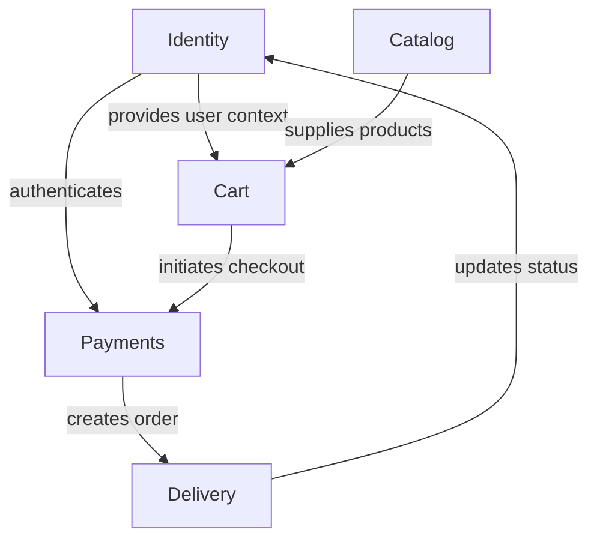

# 📘 Product Requirements Document (PRD)

**Version:** `1.0` | **Status:** `Draft`

## Table of Contents

1. Document Information
2. Governance & Workflow Gates
3. Feature Index (Living Blueprints)
4. Product Vision
5. Core Business Problem
6. Target Personas & Primary Use Cases
7. Business Value & Expected Outcomes
8. Success Metrics / KPIs
9. Ubiquitous Language (Glossary)
10. Architectural Overview (DDD – Mandatory)
11. Event Taxonomy Summary
12. Design System Strategy (MCP)
13. Feature Execution Flow
14. Repository Structure & File Standards
15. Feature Blueprint Standard (Stories & Gherkin Scenarios)
16. Traceability & Compliance Matrix
17. Non-Functional Requirements (NFRs)
18. Observability & Analytics Integration
19. Feature Flags Policy (Mandatory)
20. Security & Compliance
21. Risks / Assumptions / Constraints
22. Out of Scope
23. Rollout & Progressive Delivery
24. Appendix

---

## 1. Document Information

| Field              | Details                               |
| ------------------ | ------------------------------------- |
| **Document Title** | `itsme.fashion E-Commerce Platform Strategic PRD` |
| **File Location**  | `docs/product/PRD.md`                 |
| **Version**        | `1.0`                                 |
| **Date**           | `2026-01-13`                          |
| **Author(s)**      | `Product Team`                        |
| **Stakeholders**   | `Product, Engineering, Business`      |

---

## 2. Governance & Workflow Gates

Delivery is enforced through **explicit workflow gates**.
Execution may be human-driven, agent-driven, or hybrid.

| Gate | Name                    | Owner                | Preconditions                             | Exit Criteria            |
| ---- | ----------------------- | -------------------- | ----------------------------------------- | ------------------------ |
| 1    | Strategic Alignment     | Product Architecture | Vision, context map defined               | Approval recorded        |
| 2    | Blueprint Bootstrapping | Planning Function    | Feature issues created, blueprints linked | Blueprint complete       |
| 3    | Technical Planning      | Engineering          | DDD mapping, flags defined                | Ready for implementation |
| 4    | Implementation          | Engineering          | Code + tests                              | CI green                 |
| 5    | Review                  | Engineering          | Preview deployed                          | Acceptance approved      |
| 6    | Release                 | Product / Ops        | All checks passed                         | Production approved      |

---

## 3. Feature Index (Living Blueprints)

This section will be populated as features are defined during roadmap decomposition.

---

## 4. Product Vision

Create a premium, clean-beauty e-commerce experience that is fast, secure, and intuitive for users. The platform will deliver a trustworthy shopping environment where customers can discover ethically-sourced beauty products, make informed purchase decisions based on detailed product information, and complete transactions seamlessly.

---

## 5. Core Business Problem

Users seeking clean, ethical beauty products face multiple barriers in online shopping:

1. **Discovery Gap**: Difficulty filtering products by ethical criteria (vegan, cruelty-free) and specific categories
2. **Information Deficit**: Lack of detailed ingredient lists, usage instructions, and accurate shade representations
3. **Trust Deficit**: Uncertainty about product authenticity and ethical claims
4. **Fragmented Experience**: Cart abandonment due to complex checkout processes and lack of session persistence
5. **Post-Purchase Anxiety**: Limited visibility into order status and fulfillment tracking

These barriers lead to:
- Cart abandonment rates averaging 70%+ in beauty e-commerce
- Customer frustration and brand distrust
- Lost revenue from incomplete transactions
- High support costs from order status inquiries

---

## 6. Target Personas & Primary Use Cases

| Persona                  | Description                                                                 | Goals                                                                                           | Key Use Cases                                                                                         |
| ------------------------ | --------------------------------------------------------------------------- | ----------------------------------------------------------------------------------------------- | ----------------------------------------------------------------------------------------------------- |
| **Conscious Consumer**   | Age 25-45, values sustainability and ethics, research-oriented             | Discover verified clean-beauty products, make informed decisions based on ingredients/ethics   | Browse by ethical filters, read detailed product info, save favorites, complete secure purchases     |
| **Loyal Shopper**        | Existing customer, repeat purchaser, convenience-focused                   | Quick reordering, seamless checkout, order tracking                                             | Fast cart management, one-click reorder, persistent wishlist, order history tracking                 |
| **First-Time Visitor**   | Discovering the brand, comparison shopping, needs trust signals            | Explore catalog, verify brand claims, test purchase experience                                  | Filter products by category/ethics, read ingredients, try checkout flow                      |

---

## 7. Business Value & Expected Outcomes

| Outcome                          | Description                                                                      | KPI Alignment       | Priority |
| -------------------------------- | -------------------------------------------------------------------------------- | ------------------- | -------- |
| **Increased Conversion Rate**    | Reduce cart abandonment through streamlined checkout and persistent carts       | `KPI-001`, `KPI-002` | High     |
| **Enhanced Customer Trust**      | Build confidence through detailed product information and ethical transparency  | `KPI-003`, `KPI-006` | High     |
| **Reduced Support Costs**        | Self-service order tracking reduces inquiry volume                              | `KPI-005`            | Medium   |
| **Improved Customer Retention**  | Wishlist and account features drive repeat engagement                           | `KPI-004`            | High     |
| **Platform Scalability**         | Service-oriented architecture enables rapid feature iteration                   | N/A                  | High     |

---

## 8. Success Metrics / KPIs

| KPI ID      | Name                              | Definition                                                | Baseline | Target    | Source                 |
| ----------- | --------------------------------- | --------------------------------------------------------- | -------- | --------- | ---------------------- |
| `KPI-001`   | Cart Conversion Rate              | (Completed orders / Carts created) × 100                  | N/A      | ≥30%      | Firestore Analytics    |
| `KPI-002`   | Checkout Completion Time          | Average time from cart to order confirmation              | N/A      | ≤3 min    | OTEL Traces            |
| `KPI-003`   | Product Detail Page Engagement   | Avg time on product pages                                 | N/A      | ≥90 sec   | OTEL Metrics           |
| `KPI-004`   | Repeat Purchase Rate              | Users making 2+ purchases within 90 days / Total users    | N/A      | ≥20%      | Firestore Analytics    |
| `KPI-005`   | Order Status Self-Service Rate    | Users checking status without support contact             | N/A      | ≥85%      | OTEL Metrics           |
| `KPI-006`   | Filter Usage Rate                 | Sessions using ethical/category filters / Total sessions  | N/A      | ≥40%      | Client-side Metrics    |

---

## 9. Ubiquitous Language (Glossary)

All domain terms **must be defined once and reused consistently**.

* **Product** — A SKU in the catalog representing a single purchasable item with attributes (name, price, ingredients, ethical markers, shades)
* **Cart** — A collection of products selected by a user for potential purchase; anonymous carts persist via browser local storage only (lost on device change); authenticated user carts persist to Firestore
* **Wishlist** — A saved collection of products marked as favorites by authenticated users; strictly private (user-only visibility)
* **Ethical Marker** — A boolean flag indicating product compliance with specific standards (e.g., Vegan, Cruelty-free); sourced directly from columns in `products.csv` and treated as definitive
* **Shade** — A display-only visual representation of product color options defined by hex color codes; actual SKU selection happens at checkout, not during browsing
* **Order** — A confirmed transaction record created after successful payment, containing line items, shipping address, and payment reference; orders are immutable after payment confirmation (no cancellation or modification)
* **Fulfillment** — The process of preparing and shipping an order as a single unit (all items ship together); tracked via simulated carrier status with 5-state progression: Confirmed → Processing → Shipped → Out for Delivery → Delivered
* **Tracking ID** — A unique identifier generated to represent shipment status in the simulated delivery system
* **Shipping Address** — User-provided delivery location with basic format validation (required fields, character limits)
* **Catalog** — The complete set of products available for browsing, sourced from `products.csv`; out-of-stock products remain visible but are not purchasable (remain in cart with warning)
* **Session Persistence** — Maintaining user state (cart, authentication) across browser sessions; Firebase handles token refresh automatically (sessions never expire)
* **Payment Simulation** — Internal logic mimicking payment gateway behavior without external SDK integration; simulates 6 failure modes (insufficient funds, network timeout, invalid payment method, fraud detection, gateway downtime, partial authorization) plus success and pending states
* **Shipping Simulation** — Internal logic generating tracking IDs and status updates without external carrier API integration
* **User Profile** — User account data including email, password, display name, phone number, and default shipping address

---

## 10. Architectural Overview (DDD — Mandatory)

### Bounded Contexts

| Context             | Purpose                                                             | Core Aggregate      | Entities                              | Value Objects                        |
| ------------------- | ------------------------------------------------------------------- | ------------------- | ------------------------------------- | ------------------------------------ |
| **Catalog**         | Product discovery, search, filtering, and detailed product views   | `Product`           | `Product`, `Category`, `Brand`        | `EthicalMarker`, `Shade`, `Price`    |
| **Identity**        | User authentication, registration, profile management              | `UserAccount`       | `UserAccount`, `UserProfile`          | `Email`, `UserId`                    |
| **Cart**            | Shopping cart management and session persistence                   | `ShoppingCart`      | `ShoppingCart`, `CartItem`            | `Quantity`, `CartId`                 |
| **Payments**        | Payment processing simulation and transaction recording            | `PaymentTransaction`| `PaymentTransaction`, `PaymentMethod` | `Amount`, `TransactionId`, `Status`  |
| **Delivery**        | Order fulfillment simulation and shipment tracking                 | `Shipment`          | `Shipment`, `Order`                   | `TrackingId`, `ShippingAddress`      |

### Context Relationships



---

## 11. Event Taxonomy Summary

| Event Name                      | Producer Context | Consumers            | Trigger Aggregate       |
| ------------------------------- | ---------------- | -------------------- | ----------------------- |
| `UserRegistered`                | Identity         | Cart, Delivery       | `UserAccount`           |
| `ProductAddedToCart`            | Cart             | Catalog              | `ShoppingCart`          |
| `CartCheckedOut`                | Cart             | Payments             | `ShoppingCart`          |
| `PaymentProcessed`              | Payments         | Delivery             | `PaymentTransaction`    |
| `OrderConfirmed`                | Payments         | Delivery, Identity   | `PaymentTransaction`    |
| `ShipmentStatusUpdated`         | Delivery         | Identity             | `Shipment`              |
| `ProductSearched`               | Catalog          | Analytics            | N/A (Query)             |

---

## 12. Design System Strategy (MCP)

All UI must use a **design system delivered via MCP**.

| Parameter         | Value                                   |
| ----------------- | --------------------------------------- |
| **MCP Server**    | `To be built as part of this project`   |
| **Design System** | `itsme.fashion Design Tokens`           |
| **Framework**     | Lit Web Components                      |

**Enforcement Rules:**

1. Design system MCP development is a prerequisite for UI implementation
2. All UI components MUST be implemented using Lit web components
3. Design tokens (colors, spacing, typography) MUST be sourced from the design system MCP once available
4. Component variants MUST align with design system specifications

---

## 13. Feature Execution Flow

This section will be populated during roadmap decomposition with a Mermaid diagram showing feature dependencies and parallel execution paths.

**Diagram Location:** `docs/diagrams/feature-execution-flow.mmd`

---

## 14. Repository Structure & File Standards

Source of truth is **GitHub**.

```text
itsme-fashion-mvp/
├── .github/
│   ├── workflows/
│   └── skills/
├── docs/
│   ├── product/
│   │   ├── PRD.md
│   │   └── implementation-roadmap.md
│   ├── features/
│   │   ├── catalog/
│   │   ├── identity/
│   │   ├── cart/
│   │   ├── payments/
│   │   └── delivery/
│   ├── epics/
│   └── diagrams/
├── data/
│   └── products.csv
├── src/
│   ├── packages/
│   │   ├── design-system/
│   │   └── shared-utils/
│   └── services/
│       ├── catalog/
│       ├── identity/
│       ├── cart/
│       ├── payments/
│       └── delivery/
├── firebase.json
└── README.md
```

---

## 15. Feature Blueprint Standard (Stories & Gherkin Scenarios)

Each feature blueprint **must include**:

1. **Metadata** (issue URL, status, parent epic, bounded context)
2. **Deployment Plan** (Feature Flag defined)
3. **Stories (Vertical Slices)** — User-facing value increments
4. **Scenarios — Gherkin (Mandatory)** — Executable acceptance criteria

### Gherkin Format Example

```gherkin
Feature: Product Filtering by Ethical Markers

  Scenario: User filters products by "Vegan" marker
    Given the user is on the catalog page
    And products with various ethical markers exist
    When the user selects the "Vegan" filter
    Then only products marked as "Vegan" are displayed
    And the filter count updates to show the number of results
```

---

## 16. Traceability & Compliance Matrix

This section will be populated post-roadmap decomposition with feature-to-flag mappings.

| Feature ID | Flag ID | Flag Key                                      | Bounded Context | Status |
| ---------- | ------- | --------------------------------------------- | --------------- | ------ |
| TBD        | TBD     | `feature_fe_[id]_fl_[id]_[context]_enabled`  | TBD             | TBD    |

---

## 17. Non-Functional Requirements (NFRs)

| Metric                        | ID        | Target              | Tool                  |
| ----------------------------- | --------- | ------------------- | --------------------- |
| **Page Load Time (P95)**      | `NFR-001` | ≤2s                 | OTEL + Lighthouse     |
| **API Response Time (P95)**   | `NFR-002` | ≤500ms              | OTEL Traces           |
| **Uptime**                    | `NFR-003` | ≥99.5%              | Firebase Monitoring   |
| **Accessibility**             | `NFR-004` | WCAG 2.1 AA         | axe DevTools          |
| **Mobile Performance**        | `NFR-005` | Lighthouse ≥90      | Lighthouse CI         |
| **Cart Persistence**          | `NFR-006` | 30 days minimum     | Firestore TTL         |

---

## 18. Observability & Analytics Integration

Mandatory tooling (parameterized):

* **Analytics:** None (analytics tracking disabled for MVP)
* **Telemetry:** OpenTelemetry (OTEL)
* **Logging:** Cloud Logging (Firebase)

**Requirements:**

1. All backend operations MUST produce OTEL traces
2. Error tracking MUST capture stack traces and user context
3. Custom metrics MUST be defined for business KPIs
4. Performance monitoring via OTEL metrics

---

## 19. Feature Flags Policy (Mandatory)

### Naming Convention (Enforced)

```
feature_fe_[feature_issue]_fl_[flag_issue]_[context]_enabled
```

**Example:**
```
feature_fe_12_fl_45_catalog_search_enabled
```

### Lifecycle

1. **Creation:** Flag created during feature blueprint authoring
2. **Development:** Flag OFF in production, ON in emulator/staging
3. **Rollout:** Manual progressive enablement via Firebase Remote Config console (0% → 10% → 50% → 100%)
4. **Removal:** Flag removed after 100% rollout and 2-week stabilization period

### Storage

* **Source:** Firebase Remote Config
* **Evaluation:** Client-side and server-side
* **Default Values:** All flags default to `false` (OFF)

---

## 20. Security & Compliance

### Authentication & Authorization

* Firebase Authentication for user identity
* Email/password authentication required
* Session tokens managed via Firebase SDK
* Role-based access control (RBAC) for future admin features

### Data Protection

* PII (email, shipping address) encrypted at rest in Firestore
* Payment method details NEVER stored (simulation only)
* HTTPS enforced for all connections
* Input validation on all user-provided data (basic format validation for addresses)

### Firestore Security Rules

* **Development/Emulator:** Permissive rules to enable rapid testing
* **Production:** Strict rules enforced (open read for catalog; authenticated write for cart/wishlist; admin-only for orders)

### Regulatory Compliance

* **Locale:** UK English (en-GB) for currency (GBP), dates, and content
* GDPR considerations for UK/EU users (future scope)
* Data retention policies aligned with Firebase defaults
* User consent tracking deferred (no analytics in MVP)

---

## 21. Risks / Assumptions / Constraints

| Type       | Description                                                                                   | Mitigation                                                                                  |
| ---------- | --------------------------------------------------------------------------------------------- | ------------------------------------------------------------------------------------------- |
| **Risk**   | Product data in CSV may become stale or inconsistent                                          | Establish data governance process; validate CSV schema on import                            |
| **Risk**   | Payment/shipping simulations may not accurately reflect real-world integration complexity     | Document simulation assumptions; plan for future integration spikes                         |
| **Risk**   | Firebase emulator limitations may not surface production issues                               | Test in Firebase staging project before production deployment                               |
| **Assumption** | Users will tolerate simulated payment/shipping (development phase only)                   | Clearly communicate development status; ensure simulation realism                           |
| **Assumption** | products.csv is the definitive product data source for initial seed; Admin UI will manage updates post-launch | CSV serves as bootstrap data; Admin UI for product CRUD must be implemented                |
| **Assumption** | Out-of-stock products remain discoverable; users accept "not purchasable" warnings        | Clear UI messaging required; stock management via admin UI                                  |
| **Constraint** | Firestore instance `st-db` must be used                                                   | Architecture decisions must align with Firestore data modeling best practices               |
| **Constraint** | All development/testing MUST use Firebase emulators (no live resources)                   | CI/CD enforces emulator usage; document emulator setup in onboarding                        |
| **Constraint** | External payment (Cashfree) and shipping (Shiprocket) SDKs prohibited                     | Build internal simulators supporting 6 failure modes; defer real integration to post-MVP    |
| **Constraint** | Anonymous carts use browser local storage (not Firestore)                                 | Educates users on benefits of account creation; accepts cart loss on device change          |
| **Constraint** | Design system MCP must be built before UI implementation                                  | MCP development is a dependency blocker for frontend features                               |

---

## 22. Out of Scope

The following are **explicitly excluded** from this PRD and initial implementation:

* **Live Payment Integration** — Real Cashfree SDK integration deferred to post-MVP
* **Live Shipping Integration** — Real Shiprocket API integration deferred to post-MVP
* **Subscription/Recurring Orders** — One-time purchases only
* **Product Reviews & Ratings** — User-generated content deferred
* **Social Login** — OAuth providers (Google, Facebook) deferred
* **Multi-Language Support** — English-only (UK en-GB) for MVP
* **Multi-Currency Support** — GBP only for MVP
* **Admin Dashboard** — Product/order management UI included (required for CSV update workflow)
* **Loyalty/Rewards Program** — Points, discounts, referrals deferred
* **Live Chat Support** — Customer support integration deferred
* **Mobile Apps** — Web-only; native iOS/Android apps out of scope
* **Product Search** — Keyword search deferred; filtering and browsing only
* **Product Recommendations** — "You may also like" features deferred
* **Order Cancellation/Modification** — Orders immutable after payment confirmation
* **Advanced Error Recovery** — Generic error pages only; contextual retry/offline modes deferred
* **Split Shipments** — All items in an order ship together as single unit

---

## 23. Rollout & Progressive Delivery

### Phase 1: Internal Alpha (Emulator-Only)

* Audience: Engineering team
* Environment: Firebase Emulators
* Features: All features enabled via flags
* Goal: Validate functionality and integration

### Phase 2: Limited Beta (Firebase Staging)

* Audience: Internal stakeholders + 10-20 external testers
* Environment: Firebase staging project
* Features: Progressive flag rollout (10% → 50%)
* Goal: Validate performance, gather feedback

### Phase 3: General Availability (Production)

* Audience: Public users
* Environment: Firebase production project (`st-db`)
* Features: 100% rollout after 2-week stabilization
* Goal: Full platform launch

---

## 24. Appendix

### Referenced Documents

* Original Requirements: `README.md`
* Product Data Source: `data/products.csv`

### Tech Stack References

* **Lit Framework:** https://lit.dev/
* **Vite Build Tool:** https://vitejs.dev/
* **Firebase Platform:** https://firebase.google.com/
* **Firebase Emulators:** https://firebase.google.com/docs/emulator-suite
* **Firestore Documentation:** https://firebase.google.com/docs/firestore

### Key Decisions

* **Decision:** Use Firebase emulators exclusively for development
  * **Rationale:** Prevents accidental live resource usage; ensures reproducible local development
  * **Date:** 2026-01-13

* **Decision:** Simulate payment and shipping integrations
  * **Rationale:** Avoid external SDK lock-in during MVP; reduce development complexity; enable full emulator-based testing
  * **Date:** 2026-01-13

* **Decision:** Use `products.csv` as single source of truth for catalog data
  * **Rationale:** Client-provided dataset is definitive; avoids data modeling ambiguity
  * **Date:** 2026-01-13

* **Decision:** Build Admin UI for product CRUD operations; CSV becomes initial seed only
  * **Rationale:** Enables ongoing product management without manual CSV/import cycles
  * **Date:** 2026-01-13

* **Decision:** Shades are display-only; actual SKU selection at checkout
  * **Rationale:** Simplifies cart data model; shade browsing doesn't impact inventory
  * **Date:** 2026-01-13

* **Decision:** Anonymous carts persist via local storage; authenticated carts use Firestore
  * **Rationale:** Reduces backend complexity for guest users; incentivizes account creation
  * **Date:** 2026-01-13

* **Decision:** No analytics tracking (GA4 disabled)
  * **Rationale:** Reduces MVP complexity; OTEL metrics sufficient for performance monitoring
  * **Date:** 2026-01-13

* **Decision:** Manual feature flag rollout via Firebase Remote Config console
  * **Rationale:** Human oversight for MVP rollout; automated canary deferred to scale phase
  * **Date:** 2026-01-13
