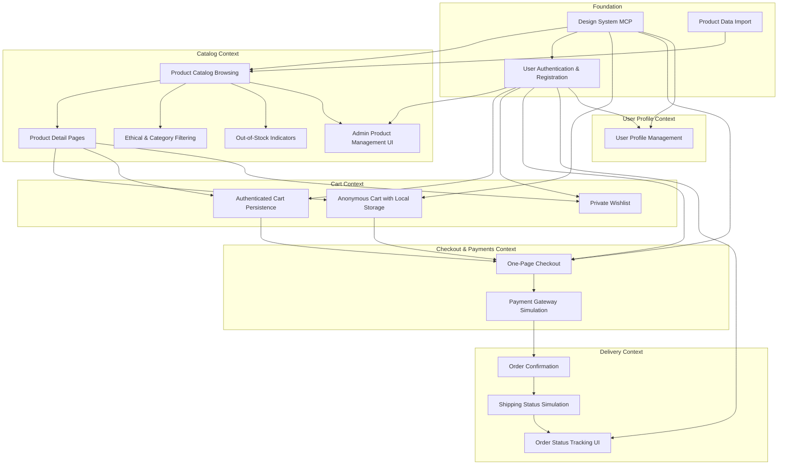

# Implementation Roadmap

## Mermaid Dependency Diagram

---

## Feature List

### Foundation Features

#### 1. Design System MCP

**Description:** A Model Context Protocol server delivering design tokens (colors, spacing, typography) and Lit web component specifications for consistent UI implementation.

**Depends on:** None

**Bounded Context:** Cross-cutting (Design System)

---

#### 2. User Authentication & Registration

**Description:** Email and password-based user registration, login, and session management via Firebase Authentication with automatic token refresh.

**Depends on:** Design System MCP

**Bounded Context:** Identity

---

#### 3. Product Data Import

**Description:** Initial CSV data import script to seed Firestore with product catalog from `products.csv` including ethical markers and shade hex codes.

**Depends on:** None

**Bounded Context:** Catalog

---

### Catalog Context Features

#### 4. Product Catalog Browsing

**Description:** Display grid view of all products with essential information (name, price, primary image, ethical markers) from Firestore.

**Depends on:** Design System MCP, Product Data Import

**Bounded Context:** Catalog

---

#### 5. Product Detail Pages

**Description:** Detailed product view showing ingredients, usage instructions, shade colors (as hex-based swatches), and full product attributes.

**Depends on:** Product Catalog Browsing

**Bounded Context:** Catalog

---

#### 6. Ethical & Category Filtering

**Description:** Filter products by ethical markers (Vegan, Cruelty-free) and product categories with dynamic result counts.

**Depends on:** Product Catalog Browsing

**Bounded Context:** Catalog

---

#### 7. Out-of-Stock Indicators

**Description:** Display visual indicators for out-of-stock products in catalog and cart with warning messages preventing purchase.

**Depends on:** Product Catalog Browsing

**Bounded Context:** Catalog

---

#### 8. Admin Product Management UI

**Description:** Authenticated admin interface for CRUD operations on product catalog (replaces manual CSV updates post-launch).

**Depends on:** User Authentication & Registration, Product Catalog Browsing

**Bounded Context:** Catalog

---

### Cart Context Features

#### 9. Anonymous Cart with Local Storage

**Description:** Shopping cart for unauthenticated users persisting to browser local storage with 30-day retention.

**Depends on:** Design System MCP, Product Detail Pages

**Bounded Context:** Cart

---

#### 10. Authenticated Cart Persistence

**Description:** Shopping cart for authenticated users persisting to Firestore with cross-device synchronization and 30-day retention.

**Depends on:** User Authentication & Registration, Product Detail Pages

**Bounded Context:** Cart

---

#### 11. Private Wishlist

**Description:** Authenticated users can save products to a private wishlist stored in Firestore with user-only visibility.

**Depends on:** User Authentication & Registration, Product Detail Pages

**Bounded Context:** Cart

---

### Checkout & Payments Context Features

#### 12. One-Page Checkout

**Description:** Streamlined checkout flow capturing shipping address (with basic validation) and payment method selection for cart contents.

**Depends on:** Design System MCP, Authenticated Cart Persistence, Anonymous Cart with Local Storage, User Authentication & Registration

**Bounded Context:** Payments

---

#### 13. Payment Gateway Simulation

**Description:** Internal payment processor simulating 6 failure modes (insufficient funds, network timeout, invalid payment method, fraud detection, gateway downtime, partial authorization) plus success and pending states.

**Depends on:** One-Page Checkout

**Bounded Context:** Payments

---

### Delivery Context Features

#### 14. Order Confirmation

**Description:** Generate immutable order record in Firestore after successful payment with line items, shipping address, and payment reference.

**Depends on:** Payment Gateway Simulation

**Bounded Context:** Delivery

---

#### 15. Shipping Status Simulation

**Description:** Automated simulation of 5-state shipment progression (Confirmed → Processing → Shipped → Out for Delivery → Delivered) with tracking ID generation.

**Depends on:** Order Confirmation

**Bounded Context:** Delivery

---

#### 16. Order Status Tracking UI

**Description:** User interface for authenticated users to view order history and current shipment status for all orders.

**Depends on:** User Authentication & Registration, Shipping Status Simulation

**Bounded Context:** Delivery

---

### User Profile Context Features

#### 17. User Profile Management

**Description:** UI for authenticated users to view and edit profile data (email, display name, phone number, default shipping address).

**Depends on:** Design System MCP, User Authentication & Registration

**Bounded Context:** Identity

---

## Feature Grouping by Epic

### Epic: Foundation & Infrastructure

**Features:**
- Design System MCP
- User Authentication & Registration
- Product Data Import

**Purpose:** Establish technical foundation and prerequisite capabilities for all other features.

---

### Epic: Product Discovery

**Features:**
- Product Catalog Browsing
- Product Detail Pages
- Ethical & Category Filtering
- Out-of-Stock Indicators
- Admin Product Management UI

**Purpose:** Enable users to discover and evaluate products based on ethical criteria and detailed information.

---

### Epic: Shopping Experience

**Features:**
- Anonymous Cart with Local Storage
- Authenticated Cart Persistence
- Private Wishlist

**Purpose:** Allow users to curate and persist product selections across sessions.

---

### Epic: Checkout & Fulfillment

**Features:**
- One-Page Checkout
- Payment Gateway Simulation
- Order Confirmation
- Shipping Status Simulation
- Order Status Tracking UI

**Purpose:** Complete transaction flow from checkout to delivery tracking.

---

### Epic: User Account Management

**Features:**
- User Profile Management

**Purpose:** Enable users to manage their account data and preferences.

---

## Execution Notes

**Critical Path:**
1. Design System MCP (prerequisite for all UI features)
2. User Authentication & Registration (prerequisite for authenticated flows)
3. Product Data Import (prerequisite for catalog features)
4. Product Catalog Browsing → Product Detail Pages → Cart Features → Checkout → Payment → Order → Shipping

**Parallel Tracks:**
- Product discovery features (Filtering, Stock Indicators, Admin UI) can develop in parallel after Catalog Browsing is complete
- Anonymous Cart and Authenticated Cart can develop in parallel (shared cart UI, different persistence)
- User Profile Management can develop independently once Authentication exists

**Feature Flag Strategy:**
- Each feature requires a dedicated flag following the naming convention: `feature_fe_[issue]_fl_[flag_issue]_[context]_enabled`
- Manual rollout via Firebase Remote Config console
- Flags remain until 100% rollout + 2-week stabilization

**Non-Functional Considerations:**
- All features must meet WCAG 2.1 AA accessibility standards
- Page load time P95 ≤ 2s
- API response time P95 ≤ 500ms
- Mobile performance Lighthouse score ≥ 90
